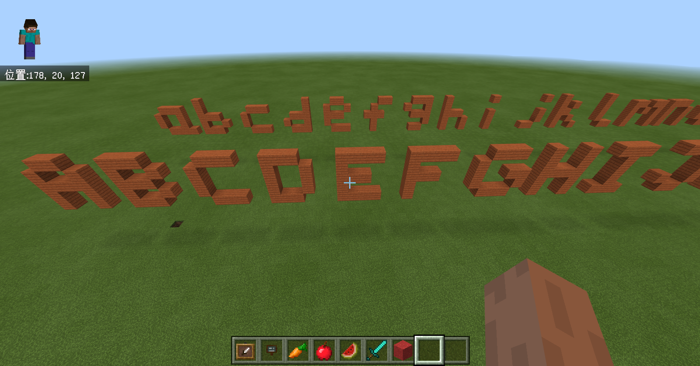

# Minecraft教育版
自从微软推出Minecraft教育版以来，越来越多的新闻报道提到Minecraft广泛被引入学校教育，用于各种学科领域的教学，涵盖的学科领域非常广泛，数学、艺术、历史、化学、计算机编程等，几乎都可以使用Minecraft这款沙盒游戏开展教学。这让我很好奇Minecraft这个只有方块的游戏到底有什么魔力，我的孩子也慢慢长大了，我也希望在少儿教育上有些了解，因此就去做了一番体验。

# 教育元素体验
做了一番简单的体验之后，我感觉Minecraft用于教学的唯一限制就是教学工作者的创造力，使用Minecraft开展教学不仅能大大提升学生的学习热情，而且更形象、直观，更能开发学生的创造力，如果你也关注少儿教育工作，我极力推荐你也来体验一下Minecraft带来的惊喜。
### 黑板系列
学校教育黑板几乎是学生学习、老师教学的唯一必备工具，Minecraft教育版也有黑板系列的工具，功能也是类似的，分为大中小三种类型，你可以根据教学需要在任意合适位置放置黑板并展示信息。  

### 物品展示
物品展示工具和黑板配合我觉得挺适合来进行英语、数字教学。  
 

### 输出字符和数字方块
Minecraft教育版提供了code connection工具可以用来进行编程教育，使用如下图所示的微软提供的make code编辑器可以使用拖动方块的方式进行编程。

下图中的大小写英文字符就是使用上图中的代码生成的，随着学习的深入你可以使用它开展计算机科学领域的教学，讲授事件、变量、迭代、条件语句、函数、数组、AI等计算机领域的概念。可以参考官方网站的教学资源[使用Make code for Minecraft的计算机科学导论](https://minecraft.makecode.com/courses/csintro)

# 如何开始？
看了本文如果你也对Minecraft教育版在教学领域的使用感兴趣，可以到[官方下载链接](https://education.minecraft.net/get-started/download/)进行下载试用，其中也包括了code connection工具。如果有教育邮箱会有15次试用机会，网上也可以找到破解版[https://www.youtube.com/watch?v=FUxJiw8rqA0](https://www.youtube.com/watch?v=FUxJiw8rqA0)，使用搜索引擎去找找吧。