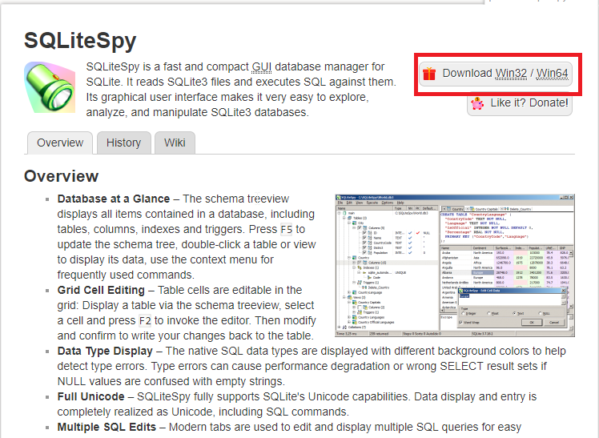
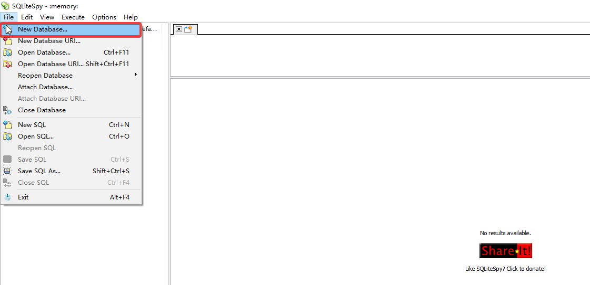
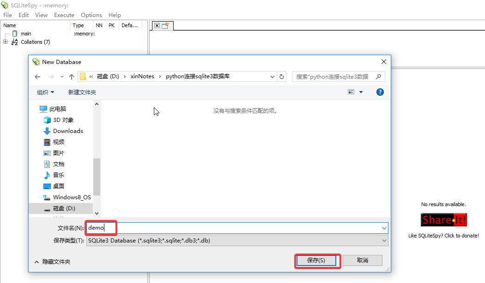
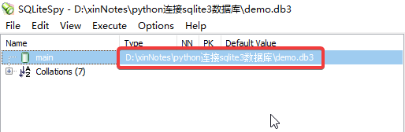
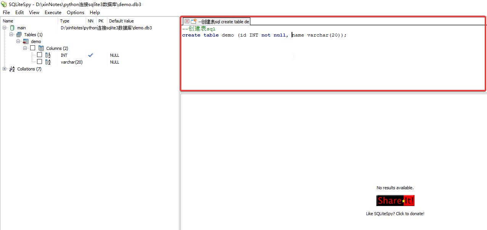
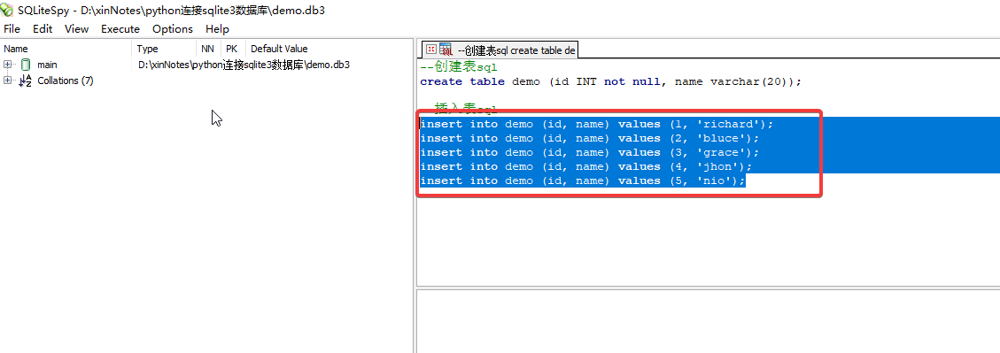
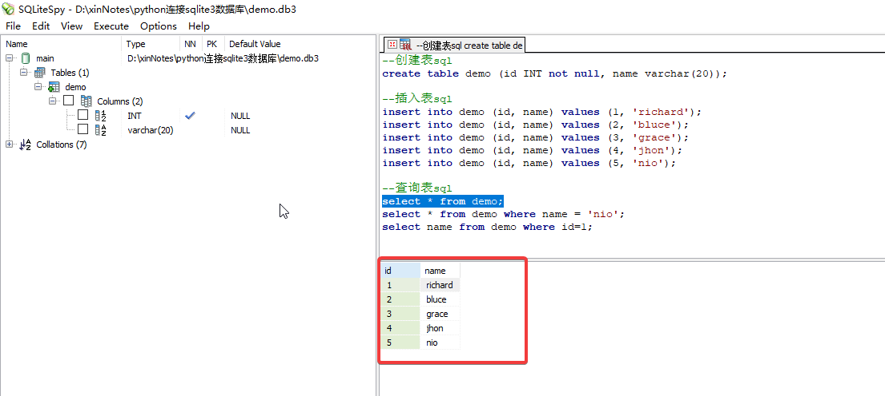
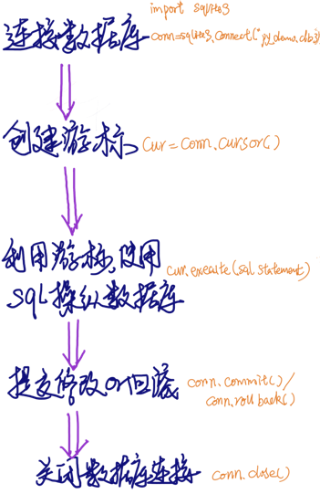
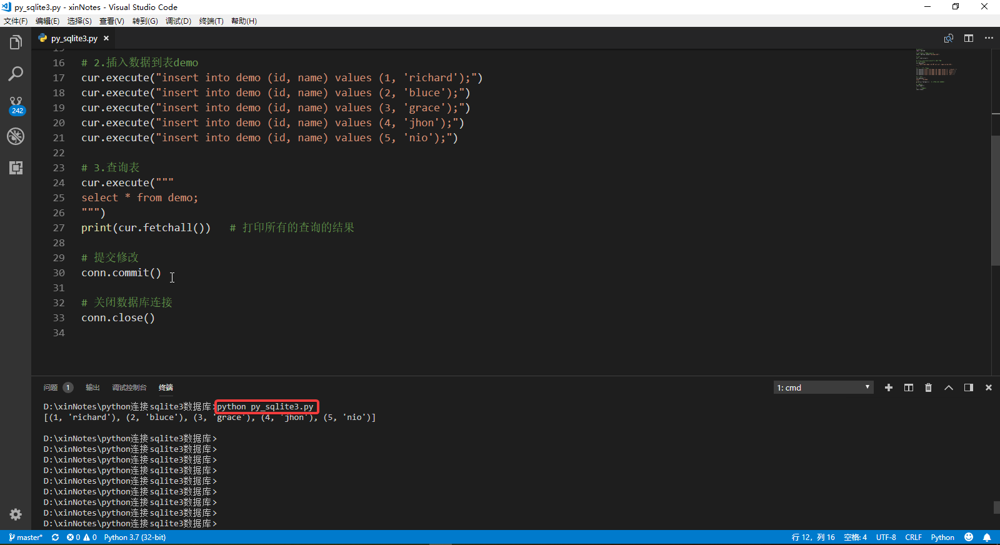

# 关于sqlite
   
SQLite是一个进程库，实现了一个**自包含的**， **无服务器**， **零配置**， **事务性**的SQL数据库引擎。SQLite的代码属于**公共领域**，因此可以免费用于任何商业或私人目的。SQLite是世界上部署最广泛的数据库。    

SQLite是一个嵌入式SQL数据库引擎。与大多数其他SQL数据库不同，SQLite没有单独的服务器进程。SQLite直接读写普通磁盘文件。具有多个表，索引，触发器和视图的完整SQL数据库包含在单个磁盘文件中。数据库文件格式是跨平台的 - 您可以在32位和64位系统之间或在big-endian和 little-endian 体系结构之间自由复制数据库 。这些功能使SQLite成为应用程序文件格式的流行选择。SQLite数据库文件是**美国国会图书馆推荐的存储格式**。认为SQLite不是Oracle的替代品，但作为fopen()的替代品。

SQLite是一个紧凑的库。启用所有功能后，库大小可能小于600KiB，具体取决于目标平台和编译器优化设置。（64位代码更大。并且一些编译器优化，例如积极的函数内联和循环展开可能导致目标代码更大。）在内存使用和速度之间存在权衡。SQLite通常运行得越快，你给它的内存就越多。然而，即使在低内存环境中，性能通常也非常好。根据它的使用方式，SQLite可以比**直接文件系统I/O更快**。

# sqlite3管理工具
图形化管理工具可以让你更好的学习、操纵、使用数据库，windows系统下个人推荐使用免费的SQLiteSpy工具。SQLiteSpy是SQLite的快速而紧凑的GUI数据库管理器。 它读取SQLite3文件并对它们执行SQL。 其图形用户界面使探索，分析和操作SQLite3数据库变得非常容易，下载链接[https://www.yunqa.de/delphi/products/sqlitespy/index](https://www.yunqa.de/delphi/products/sqlitespy/index)。  
  
接下来演示基本的创建表、插入表、查询表SQL，如果你还不了解SQL语言，跟着练习可以有一个初步的了解，如果已经很熟悉SQL了则可以跳过这部分。
下载解压后打开SQLiteSpy.exe，选择菜单项File>New Database..  

选择合适的目录，输入数据库名（如demo）后点击保存，完成后会发现main下type内容已经是刚刚创建的数据库文件路径，说明数据库文件已经连接成功。
  

1. 创建表
创建了数据库文件后就可以创建各种应用所需的数据表了，创建表使用create语句。
```
--创建表sql  （--开头的表示为注释语句）
--demo: 创建的表名称
--id：表列名，INT为整型数据类型，not null表示该字段不能为空
--name：表列名，varchar(20)为字符型数据类型，20为字符的长度限制
create table demo (id INT not null, name varchar(20));
```
右侧上面的可输入区域为sql语句输入区域，输入上面的sql，执行Execute > Execute SQL菜单项（快捷键F9），执行成功后展开main可以看到成功创建一个名为demo的表。
  

2. 插入表
表已经创建，但是目前表是空的，没有任何行数据，需要向表中插入数据，插入表使用insert语句。
```
--插入表sql
--demo：表名
--(id, name)：表列名
--(1, 'richard')：分别对应列表id, name，值类型必须和表定义中的类型匹配
insert into demo (id, name) values (1, 'richard');
insert into demo (id, name) values (2, 'bluce');
insert into demo (id, name) values (3, 'grace');
insert into demo (id, name) values (4, 'jhon');
insert into demo (id, name) values (5, 'nio');
```
在sql输入区输入以上sql向表中插入5条示例数据，选中所有insert语句执行菜单Execute > Execute SQl Selection（快捷键ctrl+F9，注意F9是执行所有输入的sql），没有弹出报错提示则表示语句执行成功。

3. 查询表
查询表数据使用select语句。
```
--查询表sql
select * from demo;  --查询表demo的所有数据
select * from demo where name = 'nio';  --查询demo表中name为nio的行数据
select name from demo where id=1; --查询demo表中id为1的行的name字段的值
```   
在sql输入区输入以上查询sql，逐条选中Ctrl+F9执行，查询的结果将在右侧下方查询结果区域显示。

# python连接sqlite3数据库
>本文通过python3进行演示，首先你PC需要安装python3的解释器，python3编程环境的搭建可以参见我的另一篇文章[python3编程环境搭建](https://www.jianshu.com/p/c88235b70229)。    

SQLite3已经是python3的标准模块，也就是说只要安装了python你就拥有了SQLite数据库，只要导入sqlite3模块你就可以开始创建数据库等一系列数据库操作了，使用python操作SQLite3数据库的流程如下所示：  
    
>游标（Cursor）是处理数据的一种方法，为了查看或者处理结果集中的数据，游标提供了在结果集中一次一行或者多行前进或向后浏览数据的能力。可以把游标当作一个指针，它可以指定结果中的任何位置，然后允许用户对指定位置的数据进行处理。   

仍然以上一节介绍的内容为例，通过python sqlite3 API来实现创建数据库、创建表、插入表、查询表等一系列操作（数据库文件名为py_demo.db3）。   
新建文件py_sqlite3.py输入以下代码
```
# filename：py_sqlite3.py
# python3.7
import sqlite3

# 创建并连接数据库py_demo.db
conn = sqlite3.connect("py_demo.db3")

# 创建游标
cur = conn.cursor()

# 通过cur.execute执行sql语句，操作数据库
# 1.创建表demo
cur.execute("""
    create table demo (id INT not null, name varchar(20));
""")

# 2.插入数据到表demo
cur.execute("insert into demo (id, name) values (1, 'richard');")
cur.execute("insert into demo (id, name) values (2, 'bluce');")
cur.execute("insert into demo (id, name) values (3, 'grace');")
cur.execute("insert into demo (id, name) values (4, 'jhon');")
cur.execute("insert into demo (id, name) values (5, 'nio');")

# 3.查询表
cur.execute("""
select * from demo;
""")
print(cur.fetchall())   # 打印所有的查询的结果

# 提交修改
conn.commit()

# 关闭数据库连接
conn.close()
```
打开终端cd到该py文件所在目录，执行命令python py_sqlite3.py，执行结果如下：

执行完毕后，检查当前目录发现会生成一个py_demo.db3的数据库文件，同样可以使用工具SQLiteSpy打开该数据库文件通过sql语句检查是否创建了表并成功插入数据，方法同SQLiteSpy介绍章节，这里不再赘述。
  