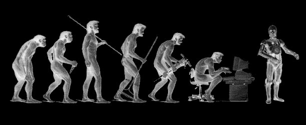

   
最近读完了李开复老师的新书《AI.未来》，由于自己的写作和总结提炼能力不佳，读完了也不知道该如何总结读书心得，这里只列出几点自己还能记起来的零碎片段吧。   
* 人工智能时代已经到来，中美两国引领人工智能的发展浪潮。
* 美国的公司更具有精英情怀，不愿意主动改变用户的习惯，认为那是不对的，而且对线下的投入不足；而中国的企业家非常务实，投入大量时间和资金去建立用户的习惯，不惜加班加点，线上线下都做到最好。这也是外国公司在中国无法竞争过本土企业的原因。
* 美国在人工智能的优势是科研能力，人工智能算法的研究；而中国公司由于大量的资金和艰苦奋斗，积累了远远多于美国的海量数据，人工智能的关键是数据，即使普通的算法在海量的数据情况下也能产生有价值的应用场景。算法本身的优势被削弱。
* 人工智能将是继工业革命、电气化之后的又一项通用技术革命，将对社会就业和社会制度体系产生巨大影响，大量的工作岗位和职业将来未来的十几年内被人工智能抢占或彻底消失，如何应对这种趋势对国家和个人将是巨大挑战。
* 具有强社交性的职业将会在未来保持安全，不易被人工智能取代，试图与人工智能竞争将是徒劳的，正确的做法是和人工智能合作，学会使用人工智能工具，通过在线教育等渠道开展终身学习。
* 人工智能也许终将释放人的自由，工作不再是人生的意义，未来追求自己的梦想才是理想的人生。