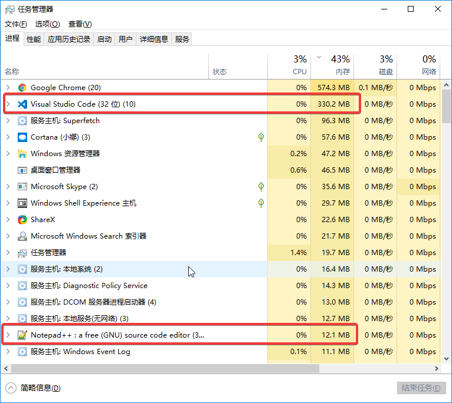
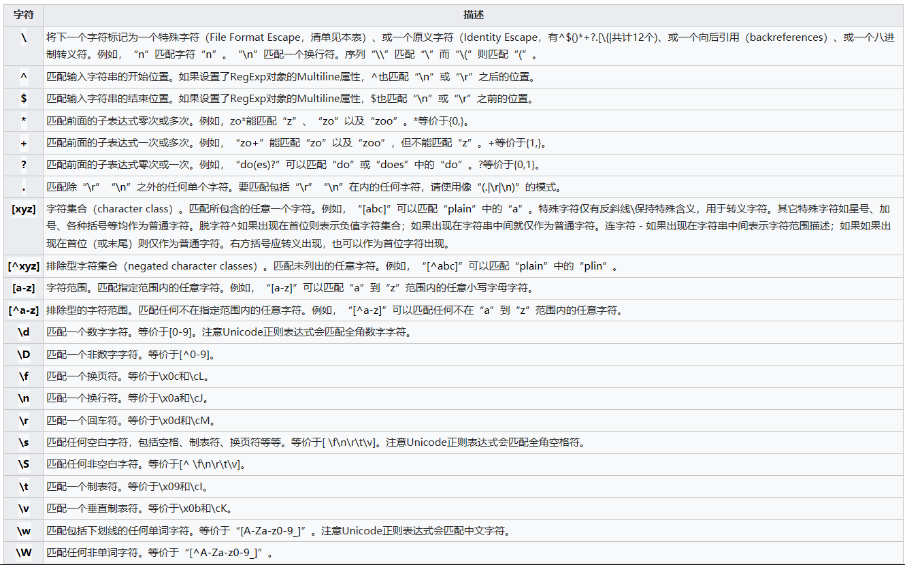
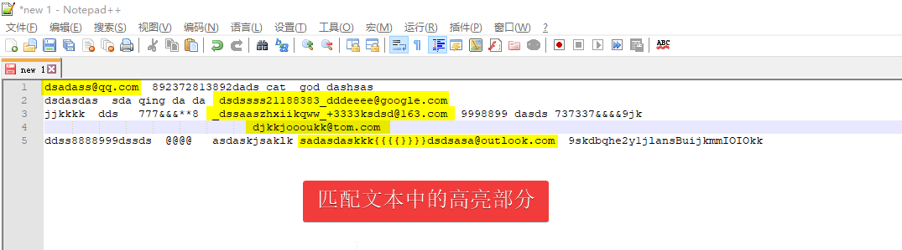
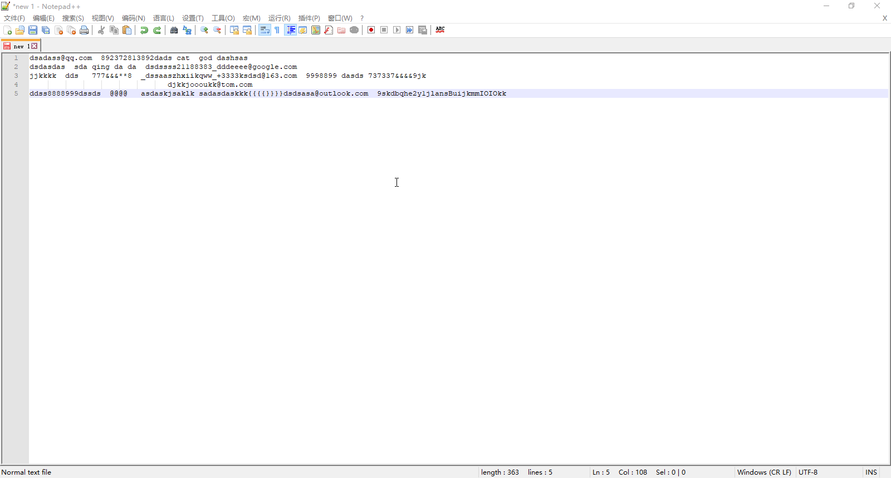
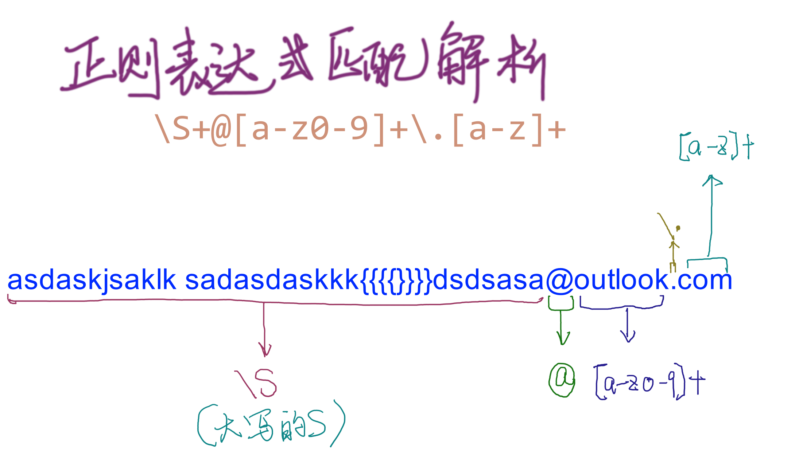
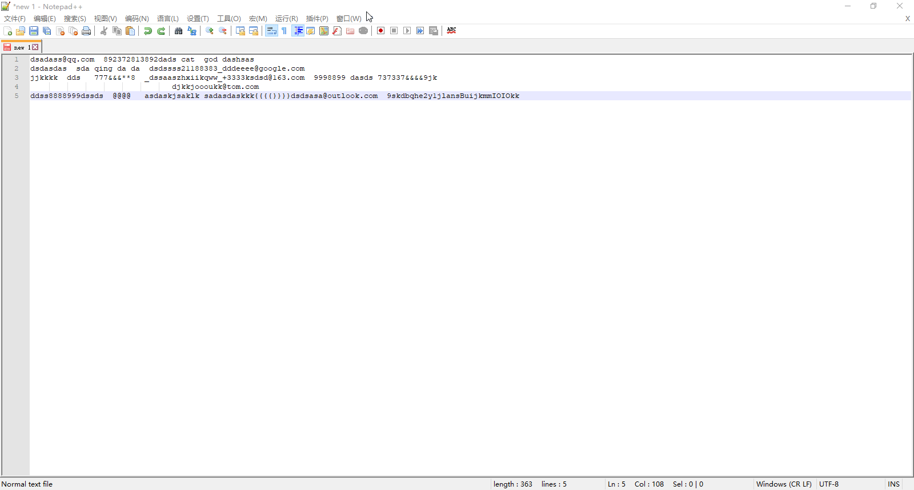

# notepad++
notepad++是一款自由软件的文本编辑器，轻量且功能强大，相关的介绍可以参见[维基百科](https://zh.wikipedia.org/wiki/Notepad%2B%2B)。我觉得最值得一提的是notepad++占用内存非常小，工作中我一般都是一直开着用来处理各种文本任务，如批量替换、查询等，下图是visual studio code和notepad++占用内存的对比，notepad++仅占用12M的内存。你可以直接点击链接[notepad++](https://notepad-plus-plus.org/)进行下载。   
   
# 正则表达式
>   正则表达式（英语：Regular Expression，在代码中常简写为regex、regexp或RE），又称正规表示式、正规表示法、正规表达式、规则表达式、常规表示法，是计算机科学的一个概念。正则表达式使用单个字符串来描述、匹配一系列匹配某个句法规则的字符串。在很多文本编辑器里，正则表达式通常被用来检索、替换那些匹配某个模式的文本。    

上面一段内容来自维基百科的介绍，总之正则表达式非常强大，哪怕只学习一些简单的正则表达式，有可能会让你的日常工作效率提升很多倍，这里我列出了一些常用的正则表达式，如果要深入学习我推荐Udacity的[cs262编程语言](https://cn.udacity.com/course/programming-languages--cs262)这门mooc课程，课程中的前几节对正则表达式做了详细的讲解和大量的练习，学了这部分内容会对正则表达式有较深入的理解。   

# notepad++正则表达式查询示例
以如下文本内容为例，让我们以正则表达式的方法匹配每一行中的邮箱地址，即下面截图中的高亮部分内容
```
dsadass@qq.com  892372813892dads cat  god dashsas
dsdasdas  sda qing da da  dsdssss21188383_dddeeee@google.com
jjkkkk  dds   777&&&**8  _dssaaszhxiikqww_+3333ksdsd@163.com  9998899 dasds 737337&&&&9jk
                               djkkjoooukk@tom.com
ddss8888999dssds  @@@@   asdaskjsaklk sadasdaskkk{{{{}}}}dsdsasa@outlook.com  9skdbqhe2y1jlansBuijkmmIOIOkk
```  

notepad++输入如上文本内容，Ctrl+F打开查找窗口，查找模式勾选正则表达式，查找目标中输入文本`\S+@[a-z0-9]+\.[a-z]+`,然后点击在当前文件中查找，在下方橘色高亮内容即为匹配的内容。

对应的匹配解析如下，可以对照上面列出的字符进行理解，当然这个匹配的正则表达式并不是唯一解，你也可以尝试使用其他的正则表达式进行匹配查询。

# notepad++正则表达式批量替换示例
仍然以上一节正则表达式查询示例中的文本内容为例，现在希望把@后的邮箱地址统一替换为outlook.com，而其余部分保持不变，我们可以利用替换功能，Ctrl+H打开（也可以通过菜单项*搜索>替换*来打开），查找目标输入`(\S+@)[a-z0-9]+\.[a-z]+`，替换为输入`\1outlook.com`，然后点击全部替换，我们可以看到所有的邮箱地址全部都替换为了outlook.com，而其他部分的内容保持不变。
我们发现`(\S+@)[a-z0-9]+\.[a-z]+`只是比之前多了一对()，它的意思匹配(pattern)中的pattern（也就是`\S+@`）并获取这一匹配的子字符串，在替换时`\1`就表示匹配的这部分字符串。
