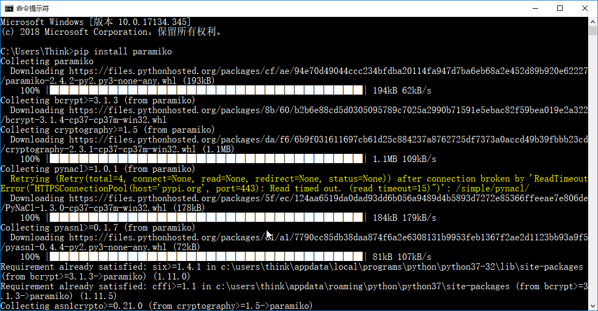
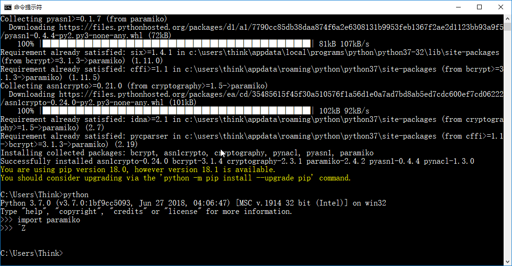
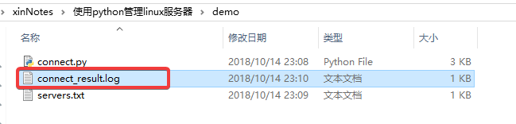
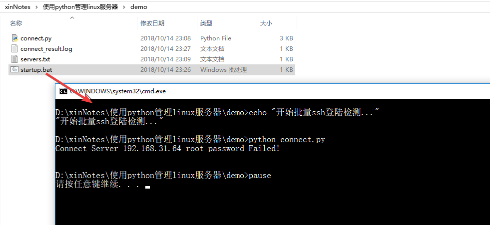

# 遇到的问题
最近工作中需要维护一批项目中使用的linux服务器，我需要及时的知道这些服务器能不能正常连接，以便及时联系实验室管理员进行处理。这批服务器都是使用ssh的方式登陆，如果通过ssh客户端逐个登陆去检查的话不仅耗时，而且鼠标不停的点来点去会让我心情烦躁。有没有更好的方式来完成这个工作哪？答案当然是肯定的。
可以使用python第三方模块Paramiko[(python SSH module)](https://github.com/paramiko/paramiko)来实现服务器的批量ssh登陆检测，使用该模块只要写一些简单的python代码就能做到这个诉求，而且还可以执行linux命令，你可以根据自己的实际的诉求去编写自己的python代码，本文仅示例批量服务器的ssh登陆检测，系统环境为windows。
# 安装Paramiko模块
打开cmd，执行pip命令安装Paramiko模块
```
pip install paramiko   
```
  


# 批量ssh登陆检查   
1. 在电脑上创建一个目录，在该目录下创建两个文件servers.txt, connect.py。    

servers.txt用来存放服务器ip及ssh登陆账户等信息，connect.py中的python代码读取servers.txt中的参数信息逐个进行ssh登陆检查并记录连接日志信息。   

servers.txt文件内容按照如下示例格式，每一行包含一个服务器的ip、ssh登陆名、ssh登陆密码信息，以空格分隔：
```
192.168.31.21 username password
192.168.31.22 username password
192.168.31.22 username password
```
connect.py代码如下：
```
import paramiko

"""
Server对象用来定义server的ip、用户名、密码以及连接日志等属性，
包含connect方法用于ssh登陆, run_cmd方法用于执行linux命令
"""
class Server():
    def __init__(self, ip, username, password):
        self.username = username
        self.password = password
        self.ip = ip
        self.connect_result = ""

    # ssh登陆并反馈连接成功或失败信息
    def connect(self):
        conn = paramiko.SSHClient()
        conn.set_missing_host_key_policy(paramiko.AutoAddPolicy())
        try:
            conn.connect(self.ip, username=self.username, password=self.password)
            self.connection = conn
            self.connect_result = "Connect Server {0} {1} {2} Successfully!\n".format(
                self.ip, self.username, self.password)
        except:
            self.connect_result = "Connect Server {0} {1} {2} Failed!\n".format(
                self.ip, self.username, self.password)
            #不能正常连接的server打印信息到控制台
            print(self.connect_result)
        return self.connect_result

    # 该方法运行建立连接后执行linux命令
    def run_cmd(self, command):
        if self.connection is None:
            print("Please run connect")
            raise ValueError("Not connected")
        (stdin, stdout, stderr) = self.connection.exec_command(command)
        return stdout.read()

# 从文件读取servers信息ip 用户名 密码
def get_all_servers_login_info(server_file="./servers.txt"):
    try:
        f = open(server_file)
        all_servers = f.read();  
    except:
        print("ERROR: 读取文件{0}失败".format(server_file))
    finally:
        f.close()
    all_servers = all_servers.split('\n')
    ssh_list = []
    for ssh in all_servers:
        if (len(ssh) > 0):
            ssh_list.append(ssh.split())
    return ssh_list

if __name__ == '__main__':
    # 读取servers.txt中的ip username password信息
    all_servers_info = get_all_servers_login_info()
    # 记录ssh登陆日志信息
    connection_log = ""
    # 逐个检查每个server ssh登陆情况
    for server in all_servers_info:
        ip, username, password = server[0], server[1], server[2]
        conn = Server(ip, username, password)
        connection_log += conn.connect()
    # 将所有服务器ssh登陆检查信息写入日志文件
    log_file = open("connect_result.log", 'w')
    log_file.write(connection_log)
    log_file.close()
```

2. 如何执行批量检测？   
打开cmd命令提示符，cd至connect.py文件所在的目录，执行如下命令后就会在当前目录下生成日志文件connect_result.log，其中记录了所有服务器的ssh登陆成功与否的信息，如果有未能成功登陆的server会在控制台窗口直接打印输出。
```
python connect.py
```

每次都打开cmd，然后cd到指定目录，然后手工输入python connect.py命令，也挺繁琐的，可以在connect.py文件所在目录下创建名为startup.bat的批处理文件，文本方式打开，输入如下保存，然后直接双击startup.bat就可以执行ssh登陆检测了。
```
echo "开始批量ssh登陆检测..."
python connect.py
pause
```
