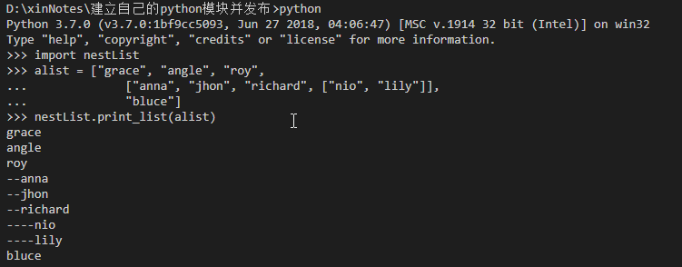
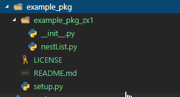
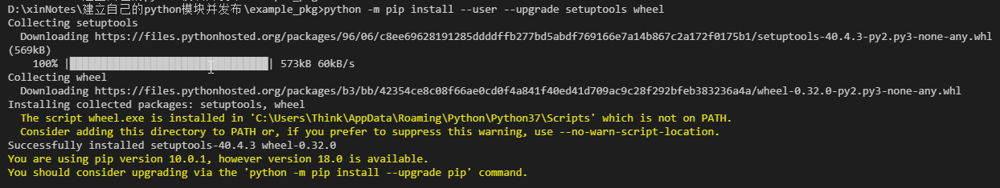
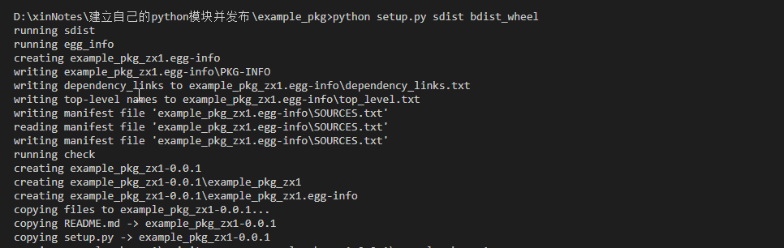
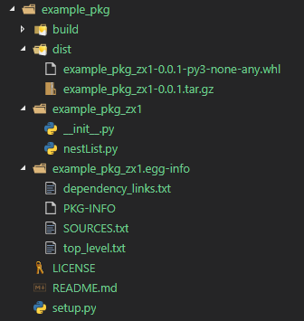
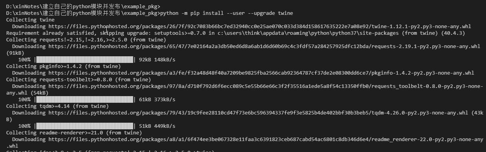
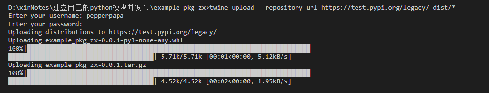
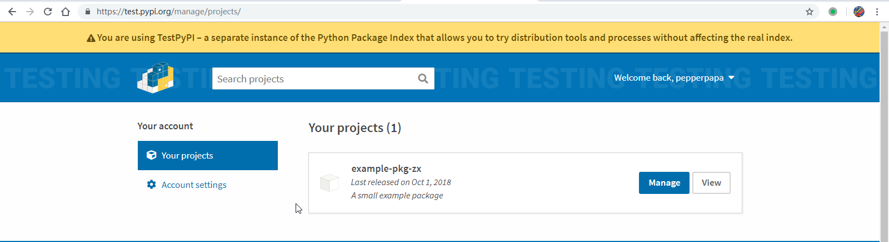
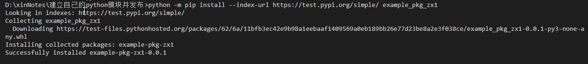
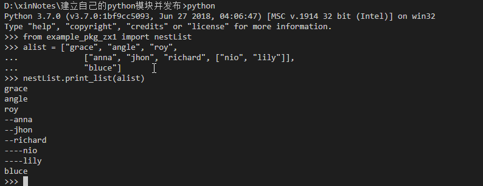

python通过模块来共享组织代码，python不仅内置了丰富的标准库，而且python社区还贡献了大量的第三方模块，正式由于第三方模块大大扩展python的应用领域，成就了如今python的江湖地位。人人都可以向社区共享代码，PyPI(Python Package Index)为第三方python模块提供了一个集中的存储库，今天我们就来尝试建立自己的模块并发布到PyPI上。
> 以下内容在windows10系统下验证OK，其他系统应该差别不大，linux系统python3版本需要将python命令替换为python3
# 创建模块
所谓模块就是一个包含python代码的文本文件，扩展名为.py。我们以一个简单的打印嵌套列表的函数为例，在某个目录下新建一个.py扩展名的文件（如nestList.py），输入如下代码：
```
#python 3.7
"""
模块示例
可以打印嵌套列表
"""

# indent表示缩进，默认0表示无缩进
def print_list(lst, indent = 0):
    for item in lst:
        # 判断列表lst中的每一项是否是list对象，
        # 如果是则递归调用print_list，同时缩进级别加1
        if isinstance(item, list):   
            print_list(item, indent + 1)
        else:
            print("--" * indent, end="")
            print(item)
```
打开终端，cd到该.py文件所在的目录，执行python命令进入交互模式，通过import直接导入该模块测试print_list函数


# 发布模块
上一节我们已经创建并测试了我们的模块，但是如果我们要共享模块，还需要一些额外的文件，这些文件集合在一起允许你构建、打包和发布你自己的模块
#### 1. 构建前的准备
构建模块前我们需要创建类似如下的文件目录结构，example_pkg目录下创建文件LICENSE,README.md,setup.py三个文件，子目录example_pkg_zx1下创建\_\_init\_\_.py（注意是两个下划线）,拷贝上一节创建的nestList.py到此目录下，我们逐个说明下其余各个文件的内容。  

* setup.py是setuptools的构建脚本，它告诉setuptools你的包的相关信息（如包名称、版本等）
```
import setuptools

with open("README.md", "r", encoding="utf-8") as fh:
    long_description = fh.read()

setuptools.setup(
    name="example_pkg_zx1",
    version="0.0.1",
    author="Example Author",
    author_email="author@example.com",
    description="A small example package",
    long_description=long_description,
    long_description_content_type="text/markdown",
    url="https://github.com/PepperPapa/xinNotes",
    packages=setuptools.find_packages(),
    classifiers=[
        "Programming Language :: Python :: 3",
        "License :: OSI Approved :: MIT License",
        "Operating System :: OS Independent",
    ],
)
```
> name，version，author，author_email，description，url根据名称的含义参考你的模块功能进行填写即可，没有特别要注意的地方。（注：name参数在上传到internet上要求必须是唯一的，不能有重复，否则无法上传）   
> long_description为读取README.md的内容，encoding="utf-8"设置是为了README.md的内容支持中文，long_description_content_type执定long_description内容格式为markdown。   
> packages通过setuptools.find_packages()函数会查找目录example_pkg_zx1下所有需要包含的模块，避免手工输入的麻烦。  
> classifiers提供一些额外的模块信息，是一个列表格式。  
* LICENSE是规定了你使用哪种协议发布自己的模块，如下MIT license的内容。如果你只是学习如何发布，直接copy如下内容即可，不用特别关注。
```
Copyright (c) 2018 The Python Packaging Authority

Permission is hereby granted, free of charge, to any person obtaining a copy
of this software and associated documentation files (the "Software"), to deal
in the Software without restriction, including without limitation the rights
to use, copy, modify, merge, publish, distribute, sublicense, and/or sell
copies of the Software, and to permit persons to whom the Software is
furnished to do so, subject to the following conditions:

The above copyright notice and this permission notice shall be included in all
copies or substantial portions of the Software.

THE SOFTWARE IS PROVIDED "AS IS", WITHOUT WARRANTY OF ANY KIND, EXPRESS OR
IMPLIED, INCLUDING BUT NOT LIMITED TO THE WARRANTIES OF MERCHANTABILITY,
FITNESS FOR A PARTICULAR PURPOSE AND NONINFRINGEMENT. IN NO EVENT SHALL THE
AUTHORS OR COPYRIGHT HOLDERS BE LIABLE FOR ANY CLAIM, DAMAGES OR OTHER
LIABILITY, WHETHER IN AN ACTION OF CONTRACT, TORT OR OTHERWISE, ARISING FROM,
OUT OF OR IN CONNECTION WITH THE SOFTWARE OR THE USE OR OTHER DEALINGS IN THE
SOFTWARE.
```
* README.md的内容也就是对模块的详细说明，示例如下：  
```
# Example Package

nestList.py是一个可以打印缩进列表的示例函数,示例代码如下：

    from example_pkg_zx1 import nestList
    alist = ["grace", "angle", "roy", 
                ["anna", "jhon", "richard", ["nio", "lily"]], 
                "bluce"]        
    nestList.print_list(alist)
```
* \_\_init\_\_.py仅一行代码，提供模块名称信息
```
name = "example_pkg_zx1"
```

#### 2. 构建发布文件
接下来就是要构建发布文件了，会用到setuptools和wheel两个工具，终端下执行如下命令确保已经安装了最新版本
> python -m pip install --user --upgrade setuptools wheel    



接着在setup.pyt文件所在目录下执行如下命令开始构建
> python setup.py sdist bdist_wheel  

  
构建完成后会创建多个文件及目录，其中dist目录下会生成.whl和.tar.gz两个文件


# 上传模块到PyPI
最激动人心的莫过是把自己的模块分享到internet上，让全球的程序员都能使用你贡献的代码，想想都很激动吧。因为只是演示如何上传模块，并不是真正有用的模块，最好是能通过一个测试平台来给大家来练习，Test PyPI就是提供这样的功能，让你随意上传自己的模块进行测试和实验，首先你需要在[注册Test PypI页面](https://test.pypi.org/account/register/)上注册一个账户并登陆邮箱验证。上传发布包需要用到twine这个工具，首先需要通过下面的命令进行安装。
> python -m pip install --user --upgrade twine


安装成功后，在example_pkg目录下使用下面的命令上传你的发布包
> twine upload --repository-url https://test.pypi.org/legacy/ dist/*


> 说明：
> 1.你的模块名称及子目录名称（示例为example_pkg_zx1）不能有重复，否则上传会失败，提示HTTPError: 403 Client Error: The user 'xxxx' isn't allowed to upload to project 'example-pkg'错误，遇到这种情况需要修改子目录example_pkg_zx1及setup.py中的name，然后重新尝试上传直到成功。

提示上传成功后，登陆Test PypI页面Your projects下查看应该就能看到你上传的模块了。


# 从PyPI安装自己的模块
你可以使用pip从Test PyPI上安装你的模块来验证是否能工作，example_pkg_zx1为模块名称
> python -m pip install --index-url https://test.pypi.org/simple/ example_pkg_zx1

> 注意上面的命令不要在example_pkg目录下执行，否则会提示模块已经存在而不执行安装，随意cd到其他的目录下执行


交互模式下测试已安装的模块


# 最后的提示
如果你已经准备好了正式发布自己的模块到PyPI（**与Test PyPI不同哦**），你需要首先在[https://pypi.org](https://pypi.org)上注册正式的账户并验证邮箱，twine上传命令直接使用"twine upload dist/*"命令即可，不用再指定url；同样从PyPI安装模块直接使用命令"pip install your-package-name"进行安装，也不用执行url。